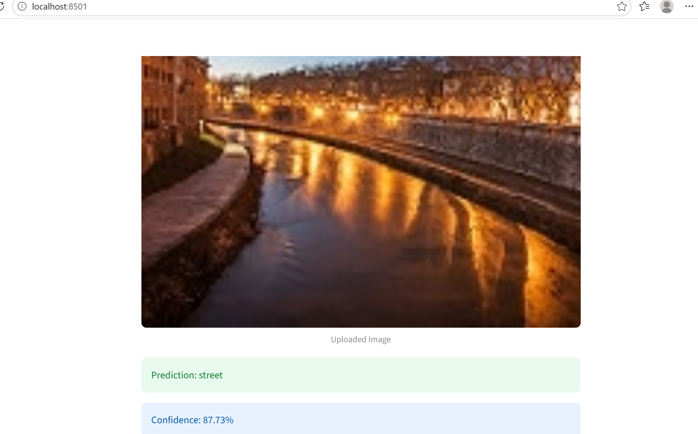
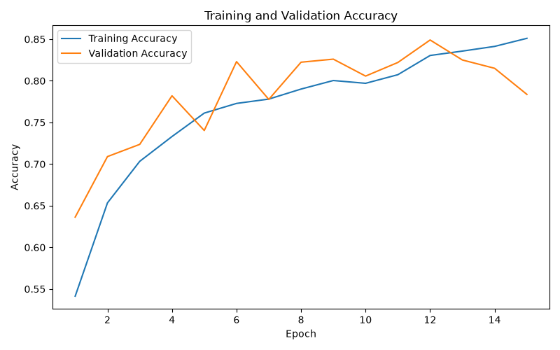
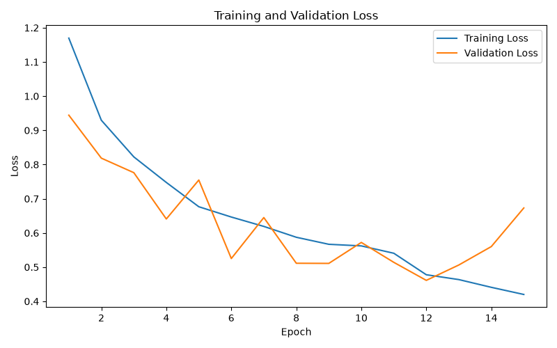

# CNN Image Classification with Streamlit

A deep learning computer vision project that classifies natural scene images into six categories using a Convolutional Neural Network.

## Classes

- Buildings
- Forest
- Glacier
- Mountain
- Sea
- Street

## Project Features

- CNN model built with TensorFlow and Keras
- Image preprocessing and data augmentation
- Model training and evaluation
- Approximately 84.90% test accuracy
- Prediction script for individual images
- Streamlit web application
- Confidence score for each prediction

## Project Structure

```text
cnn-image-classification-azure/
├── src/
│   ├── train.py
│   ├── predict.py
│   └── app.py
├── deployment/
├── images/
├── models/
├── notebooks/
├── requirements.txt
├── .gitignore
└── README.md
```


## Project Screenshots

### Home Page


### Prediction Example


### Training Accuracy


### Training Loss

